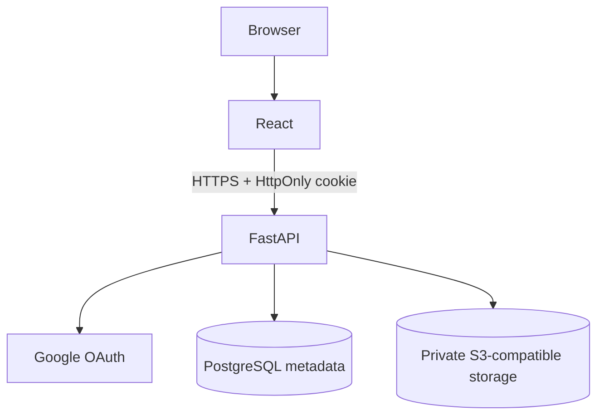

# Secure Content Portal

Secure sharing of internal training videos, PDF documents, and HTML reference
material. The application uses Google OAuth, database-backed HttpOnly sessions,
server-side role enforcement, and private object storage.

## Features

- Google OAuth only; no passwords or frontend tokens
- Viewer and Admin roles, enforced by FastAPI dependencies
- Admin upload, metadata editing, and confirmed deletion
- MP4 range streaming, authenticated PDF delivery, and sandboxed HTML viewing
- PostgreSQL metadata with Alembic migrations
- S3-compatible storage in production and a private local adapter for development
- Responsive React/Vite interface with loading, empty, and error states

## Architecture



See [architecture.md](architecture.md) for the security boundaries and the
reasoning behind the major choices.

## Technology stack

- Frontend: React, Vite, React Router, PDF.js
- Backend: Python, FastAPI, SQLAlchemy, Alembic, Authlib
- Database: PostgreSQL
- Storage: S3-compatible object storage or private local development storage

## Project structure

```text
backend/app/
    config/       environment settings
    database/     SQLAlchemy engine and sessions
    models/       PostgreSQL entities
    routes/       auth, content, and admin APIs
    services/     authentication and storage services
    middleware/   security headers
    schemas/      validated API responses
frontend/src/
    App.jsx       routed portal experience
    App.css       responsive portal styles
```

## Local setup

Create a PostgreSQL database named `secure_content_portal`, then configure the
backend:

```powershell
Copy-Item .env.example backend/.env
cd backend
python -m venv .venv
.\.venv\Scripts\Activate.ps1
pip install -r requirements.txt
\.venv\Scripts\alembic.exe upgrade head
\.venv\Scripts\python.exe -m uvicorn app.main:app --reload
```

In another terminal:

```powershell
cd frontend
npm install
npm run dev
```

The API is available at `http://localhost:8000`, Swagger at
`http://localhost:8000/docs`, and the frontend at `http://localhost:5173`.

## Environment variables

Use [.env.example](.env.example) as the template. Important values are:

- `DATABASE_URL`: SQLAlchemy PostgreSQL URL
- `GOOGLE_CLIENT_ID`, `GOOGLE_CLIENT_SECRET`, `GOOGLE_REDIRECT_URI`: OAuth client configuration
- `SESSION_SECRET`, `COOKIE_SECURE`: session and cookie settings
- `FRONTEND_URL`, `BACKEND_URL`: origin and callback configuration
- `ADMIN_EMAILS`: comma-separated Google email allow-list for promotion
- `STORAGE_BACKEND`: `local` for development or `s3` in deployment
- `STORAGE_ENDPOINT`, `STORAGE_BUCKET`, `STORAGE_ACCESS_KEY`, `STORAGE_SECRET_KEY`: private object storage
- `MAX_VIDEO_SIZE_MB`, `MAX_PDF_SIZE_MB`, `MAX_HTML_SIZE_MB`: upload limits

Never commit `backend/.env`, credentials, or object-storage keys.

## Google OAuth setup

Create a Google OAuth web client and add the local callback
`http://localhost:8000/api/auth/callback` plus the production backend callback
to its authorized redirect URIs. Set the client ID, secret, and callback in
`backend/.env`. Add trusted administrator addresses to `ADMIN_EMAILS`; all
other first-time identities are created as viewers.

## PostgreSQL setup

Create a PostgreSQL database and set `DATABASE_URL`. Apply migrations with
`alembic upgrade head`. The schema stores user, session, and content metadata;
binary content is never stored in PostgreSQL.

## Storage setup

Local development uses a private `.private_storage` directory ignored by Git.
For deployment, set `STORAGE_BACKEND=s3` and provide a private S3-compatible
bucket plus its endpoint and credentials. Do not enable public object access.

## Authentication and authorization

`GET /api/auth/login` starts Google OAuth. The callback validates the Google
identity, creates or updates a user, and stores only a random session token hash
in PostgreSQL. The raw token is held in an HttpOnly cookie. New users are
viewers; emails in `ADMIN_EMAILS` become administrators.

Every protected endpoint calls `get_current_user()`. Admin endpoints additionally
call `require_admin()`. UI visibility is only a usability feature; it is not the
security boundary.

State-changing requests validate the browser `Origin` when supplied. SameSite
cookies and origin validation provide CSRF protection for the cookie session.

## API endpoints

| Method | Endpoint | Access |
| --- | --- | --- |
| GET | `/api/auth/login` | Public |
| GET | `/api/auth/callback` | OAuth callback |
| GET | `/api/auth/me` | Authenticated |
| POST | `/api/auth/logout` | Authenticated |
| GET | `/api/content` | Authenticated |
| GET | `/api/content/{id}` | Authenticated |
| POST | `/api/admin/content` | Admin |
| PATCH | `/api/admin/content/{id}` | Admin |
| DELETE | `/api/admin/content/{id}` | Admin |
| GET | `/api/content/{id}/stream` | Authenticated video |
| GET | `/api/content/{id}/pdf` | Authenticated PDF |
| GET | `/api/content/{id}/html` | Authenticated HTML |

## Testing

```powershell
cd backend
\.venv\Scripts\python.exe -m pytest -q
\.venv\Scripts\alembic.exe check
cd ..\frontend
npm run lint
npm run build
```

The security suite covers unauthenticated access, viewer denial, invalid file
types, and the admin upload/edit/delivery/delete lifecycle.

## Deployment

Deploy the frontend to Vercel or Netlify, the FastAPI service to Render or an
equivalent HTTPS host, PostgreSQL to Neon/Supabase, and storage to a private
Supabase Storage or S3-compatible bucket. Set `STORAGE_BACKEND=s3`, configure
the production OAuth callback URI in Google Cloud, set `COOKIE_SECURE=true` and
`COOKIE_SAMESITE=none` when frontend and backend are on different sites, and
restrict `FRONTEND_URL` to the deployed frontend origin. Do not use
wildcard CORS with credentials.

The repository contains deployment-ready configuration, but a live deployment
requires the operator's provider accounts, Google OAuth credentials, database,
and storage secrets; those cannot be generated locally or committed safely.

## Live demo

No live demo is configured in this repository. Deployment requires external
provider accounts and secrets that are intentionally not committed.

## Security limitations

Private storage, authenticated APIs, authorization checks, random storage keys,
and non-public URLs are the real security boundaries. PDF.js controls the viewer
experience but cannot prevent extraction. Once an authorized browser receives
content, a determined user can capture or reproduce it. Stronger future options
include watermarking, DRM, HLS, expiring delivery tokens, and forensic auditing.

## Future improvements

Potential next steps are HLS/DRM for higher-value video, forensic watermarking,
expiring session-bound delivery tokens, audit logs, search/filtering, and
automated browser tests against a deployed environment.